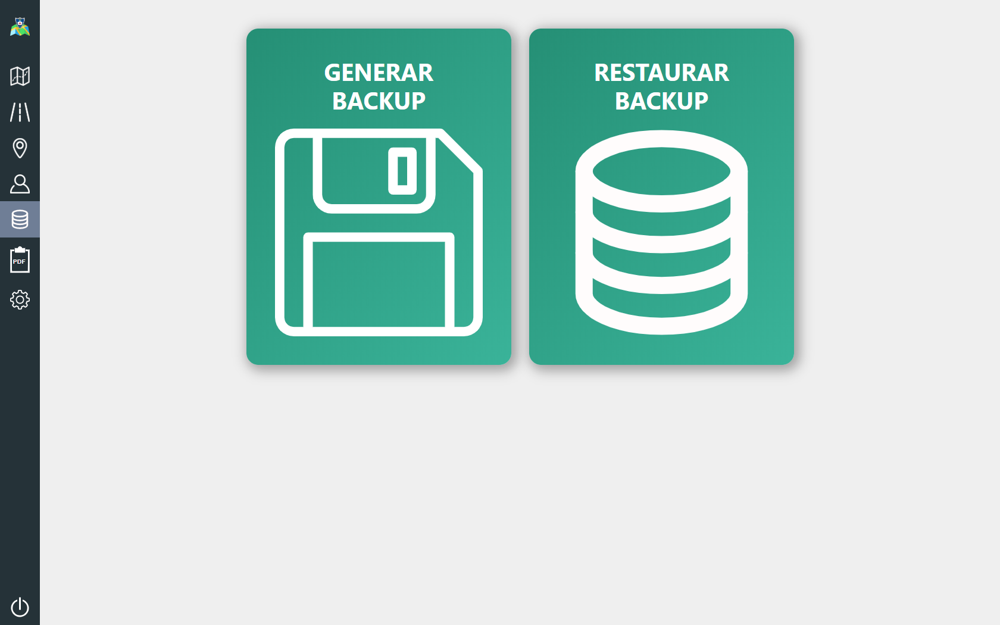
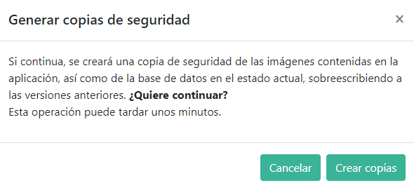
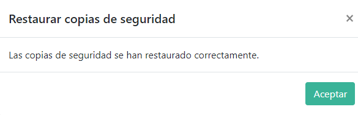

## COPIA DE SEGURIDAD BASE DE DATOS E IMÁGENES

Desde aquí podrá realizar una copia de seguridad, tanto de la base de datos como de las imágenes contenidas en la aplicación e, igualmente, será posible su restauración en caso de pérdida o borrado accidental.

Al hacer click en *generar o restarurar backup* se mostrará un mensaje en el que se avisa de la operación que se va a realizar y de que esta puede tardar unos minutos, en función del tamaño de los datos que se van a guardar o restaurar. Aquí es posible volver atrás haciendo click en *cancelar*

Una vez finalizada la copia o restauración, se mostrará un mensaje informando del éxito de la operación.

La copia de la base de datos se guardará en la carpeta ***storage*** con el nombre *celiamaps.sql*

Las imágenes serán restauradas en sus respectivas carpetas originales.

