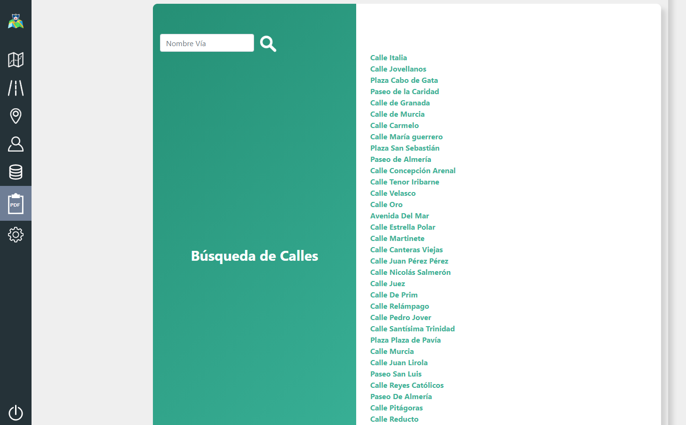
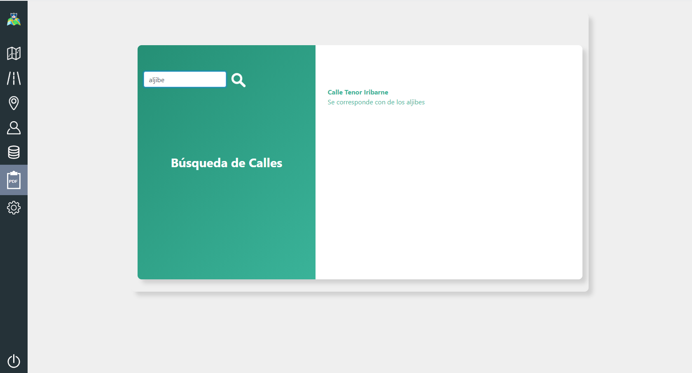
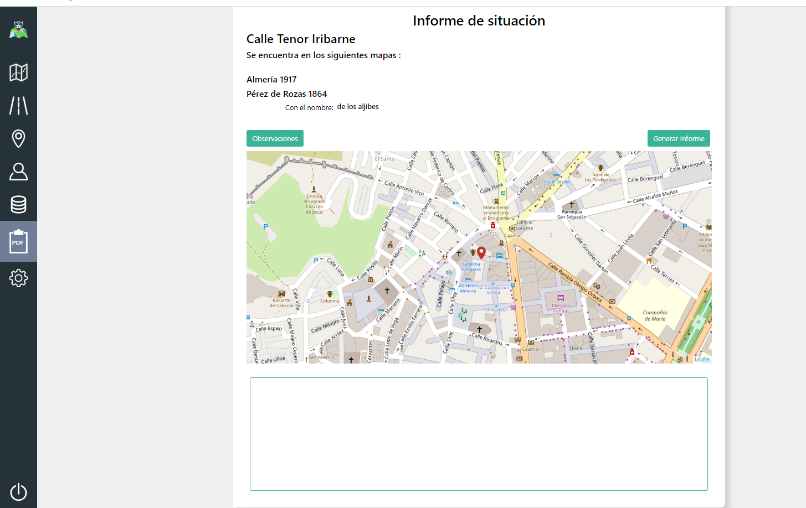
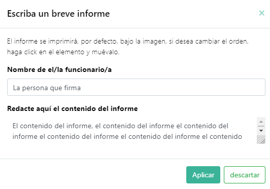
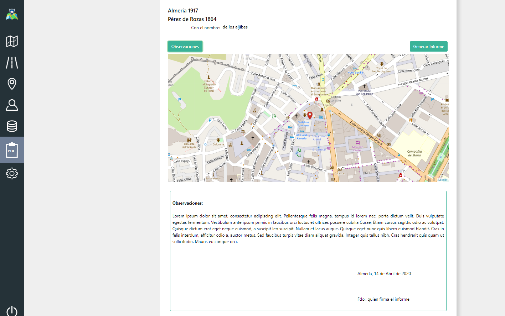
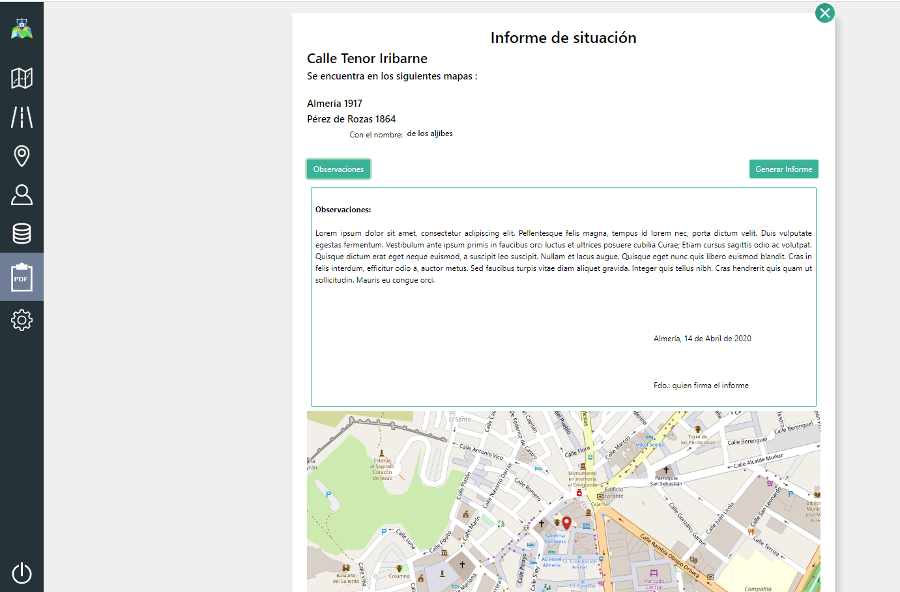
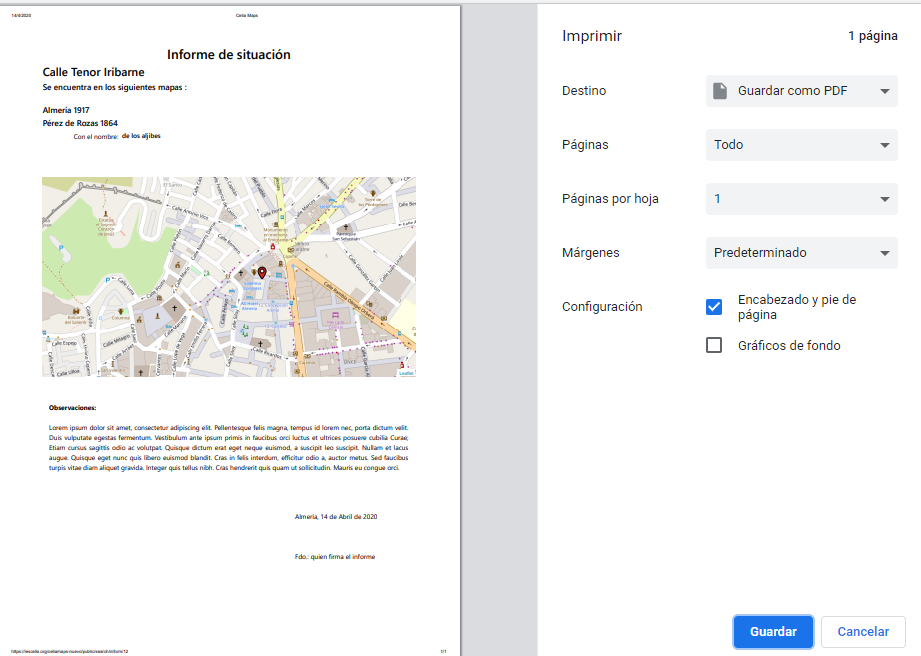

## BÚSQUEDA DE CALLES Y ELABORACIÓN DE INFORMES

Desde aquí es posible realizar la búsqueda de una calle y, una vez seleccionada, elaborar un informe en el que constarán:

- El nombre de la calle en la actualidad.
- Los nombres que ha tenido esa misma calle anteriormente, si existen, y el de los mapas en los que aparecía.
- Una imagen del mapa actual y su ubicación en él.
- La posibilidad de incluir un apartado de observaciones, si procede.

### BÚSQUEDA DE LA CALLE

Al realizar la búsqueda de la calle, en el resultado aparecerá, en primer lugar, un enlace con el nombre actual de la calle, resaltado, y debajo, si existen, el nombre o nombres que esa calle haya podido tener en mapas anteriores.

Del mismo modo, si se realiza la búsqueda sobre una calle antigua y que en la actualidad tiene otro nombre, el resultado será el mismo, es decir, enlace con nombre actual resaltado y debajo nombre antiguo.

### PRIMERA VISTA DEL INFORME

Al hacer click sobre el enlace resultado de la búsqueda, pasará a la vista del informe con los nombres de las calles y la imagen del mapa actual, con su ubicación. En este punto, puede decidir si quiere imprimir esta vista tal cual aparece en pantalla, o si prefiere redactar un informe en la misma.

### REDACCIÓN DE INFORMES

Para redactar un informe en la vista debe hacer click en el botón ***observaciones***, aparecerá un cuadro con unas breves instrucciones (cuadro de escritura) y en el que escribirá el nombre de la persona que firma y debajo el apartado en el que puede redactar el informe completo.

Una vez acabada la redacción del informe, haga click en ***aplicar*** y en el recuadro con borde verde que aparece bajo el mapa, se imprimirá lo escrito en el cuadro de escritura, además de la fecha actual.

Si desea cambiar el contenido del informe, pero ya ha elegido ***aplicar***, basta con volver a hacer click en ***observaciones*** y, de nuevo, se mostrará el cuadro de escritura, donde podrá borrar o sobreescribir lo que sea necesario para modificar el informe, tantas veces como desee, incluso después de imprimirlo o guardarlo, pero si lo que quiere es borrar todo lo escrito, entonces haga click en ***descartar*** y se borrará el contenido impreso en la vista. 

En cualquier caso, todo lo que se escriba en el cuadro de escritura permanecerá en él hasta que salga de la vista.

### UBICACIÓN DEL INFORME

La ubicación del informe redactado, se encuentra, por defecto, bajo la imagen del mapa, pero se puede mover y colocar sobre el mapa, basta con hacer click en el recuadro con borde verde bajo el mapa y arrastrar hacia arriba. Se incluye video demostrativo.

[ver video](media/informes/informeVideo.mp4)

### IMPRESIÓN DE INFORMES

Para imprimir la vista, basta con hacer click en ***generar informe***, podrá elegir imrpimir o guardar en pdf.

