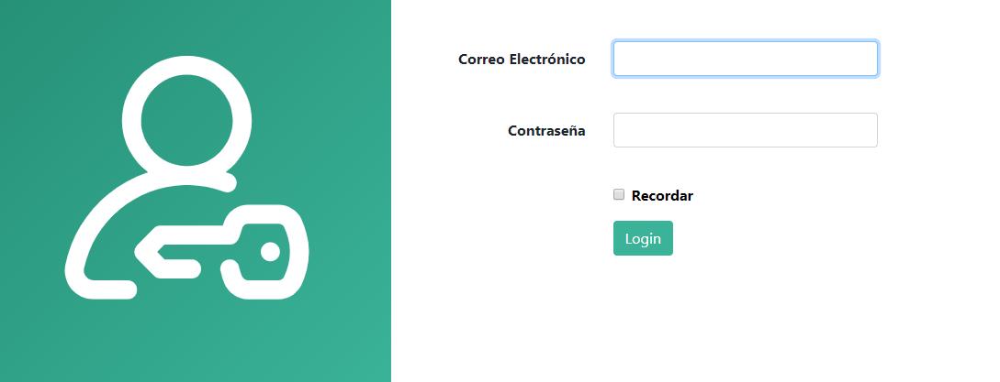

## INSTALACIÓN DE LA APLICACIÓN CELIAMAPS
\(pendiente de acabarlo bien\)

### REQUISITOS DE INSTALACIÓN

### PASOS PARA INSTALAR LA APLICACIÓN

1. Clonar el repositorio a un directorio de su servidor.
2. Cambiar el nombre del archivo ***.env.example*** por ***.env*** \(se encuentra en el directorio raiz\).
3. Crear una base de datos vacia en el servidor.
4. Escribir en la barra de direcciones de su navegador
~~~
    http://host/app/install
~~~
Donde ***host*** es el nombre de dominio de su servidor y ***app*** el nombre del directorio donde ha clonado el repositorio.

4. Rellenar el formulario con los datos de configuración

 

 En este paso se configurará en archivo ***.env*** y se crearán las tablas de su base de datos

5. Rellenar el siguiente formulario con los datos del primer usuario

En este paso se creará el primer usuario y le llevará a la página del login donde podrá introducir el email y la contraseña y ya estará dentro de su aplicación, totalmente operativa.

6. 
