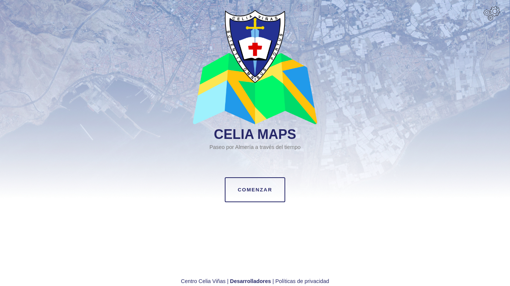
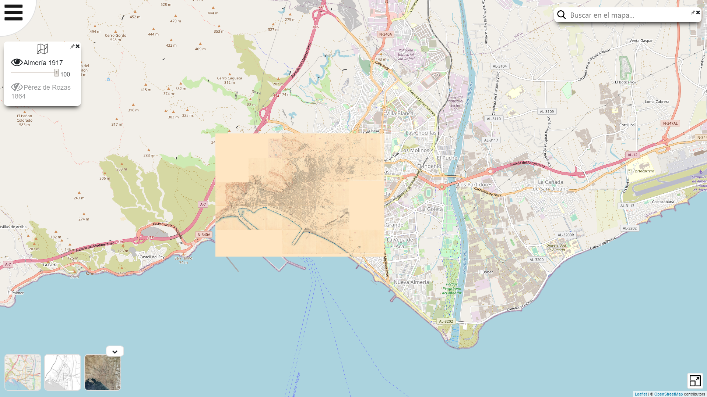
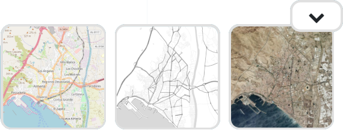
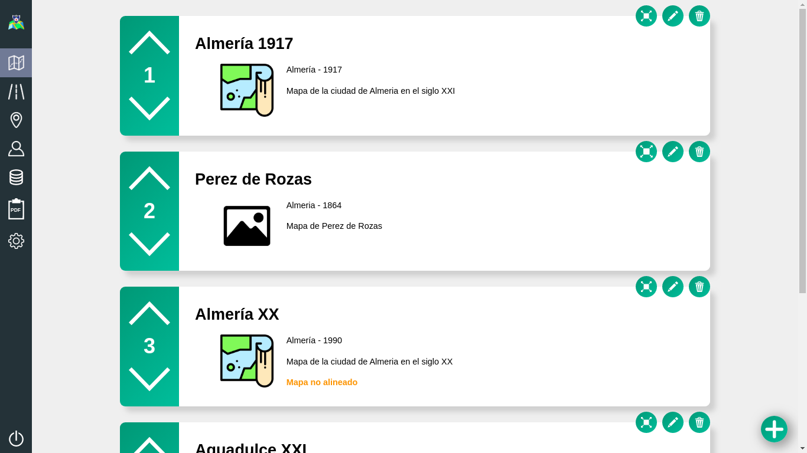
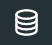
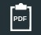
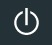

# Interfaz de la aplicación

En este apartado explicaremos la pantalla de bienvenida y la interfaz principal que será usada tanto por el usuario visitante como por el usuario administrador.

## Página de bienvenida

Consiste en un sitio web estático que sirve como recepción al usuario visitante que desea usar la aplicación web.

Contiene información sobre los desarrolladores, el centro docente y las políticas de privacidad. 

El botón **comenzar** lleva al usuario a la vista de visitante en la que se podrán consultar mapas, vías y puntos de interés publicados por los usuarios administradores de la aplicación.

Las **engranajes** de la esquina superior derecha permiten el acceso al panel de inico de sesión para la administración de la aplicación web.

## Interfaz de usuario visitante

Desde la página de bienvenida podremos acceder a la vista de visitante de la aplicación haciendo click en comenzar. Esta vista permite a cualquier navegante acceder y visualizar el contenido de esta aplicación web pero no modificarlo.

La interfaz del usuario visitante será algo así:

En esta vista aparecen una serie de componentes que vamos a analizar para facilitar el uso de la aplicación.

### Menú de opciones

El menú de opciones se encuentra situado en la parte superior izquiera de la pantalla y al hacerle click se despliegan las siguientes opciones:

 Buscador: Habilita o deshabilita el componente buscador que nos permite encontrar vías y puntos de interés en los mapas. Esta ventana puede ser posicionada en cualquier parte de la pantalla arrastrándola con el ratón. Al buscar una vía o punto de interés se nos desplegarán las opciones disponibles en la aplicación que coincidan con la busqueda realizada. Además este componente puede ser fijado haciendo click en el icono de chincheta situado justo al lado del botón de cerrar en la esquina superior derecha.

 Mapas: Nos permite habilitar o deshabilitar los mapas existentes además de cambiar las transparencias de estos para la superposición de mapas. Tenemos la opción de hacer click sobre el nombre del mapa para deshabilitarlo ademaś de la barra de opacidad. Este componente se comporta de la misma forma que el buscador para ser posicionado o fijada en cualquier punto de la pantalla.

 Puntos de interés: Habilita o deshabilita los puntos de interés disponibles. Al buscar un punto de interés estos serán habilitados automáticamente.

 Vías: Habilita o deshabilita vías disponibles. Al buscar una vía estas serán habilitados automáticamente.

### Planos disponibles

En este menú que se despliega y oculta con una flecha situada en la parte inferior izquierda de la pantalla alternarmos entre los distintos planos disponibles en la aplicación. Cabe aclarar que estos planos son servicios externos y que en un momento dado pueden fallar  de forma ajena a la aplicación.

Este menú tiene la siguiente apariencia cuando está desplegado:

### Modo pantalla completa

El botón  situado en la esquina inferior derecha activa o desactiva el modo pantalla completa de la aplicación.

## Interfaz de usuario administrador

Como hemos comentado anteriormente el acceso a la administración de la aplicación se realizará a través del botón con icono de engranajes en la pantalla de bienvenida. Esto nos dará acceso a un panel de inicio de sesión que verificará los credenciales introducidos para dar acceso al usuario al panel de administración de la aplicación.

La interfaz de la administración de la aplicación será así:

En este panel de administración encontramos un menú vertical en el lateral izquiero de la pantalla donde tenemos las siguientes opciones:

 Vista de visitante: Lleva al usuario administrador a la vista de visitante sin cerrar la sesión.

 Mapas: Permite la gestión de los mapas con los que la aplicación va a trabajar. Más información [aquí](https://github.com/SergioMorenoAntequera/CeliaMaps/blob/develop/doc/maps.md).

 Vías: Permite la gestión de vías sobre los mapas de la aplicación. Más información [aquí](https://github.com/SergioMorenoAntequera/CeliaMaps/blob/develop/doc/streets.md).

 Puntos de interes: Permite la gestión de puntos de interés sobre los mapas de la aplicación. Más información [aquí](https://github.com/SergioMorenoAntequera/CeliaMaps/blob/develop/doc/hotspots.md).

 Usuarios: Permite la gestión de los usuarios administradores de la aplicación. Más información [aquí](https://github.com/SergioMorenoAntequera/CeliaMaps/blob/develop/doc/usuario.md).

 Copias de seguridad: Permite la generación y restauración de copias de seguridad de la base de datos incluyendo mapas, vías, puntos de interés así como las imágenes de estos últimos. Más información [aquí](https://github.com/SergioMorenoAntequera/CeliaMaps/blob/develop/doc/backup.md).

 Informes: Permite la generación de informes sobre las vías existentes en la base de datos de la aplicación. Más información [aquí](https://github.com/SergioMorenoAntequera/CeliaMaps/blob/develop/doc/informes.md).

 Configuración de la aplicación: Permite ajustar el foco de la aplicación sobre una zona del plano además de gestionar los marcadores utilizados para centrar los mapas introducidos por el usuario.Más información [aquí](https://github.com/SergioMorenoAntequera/CeliaMaps/blob/develop/doc/settings.md).

 Cerrar sesión: Cierra la sesión del usuario administrador redireccionando la aplicación a la página de bienvenida.