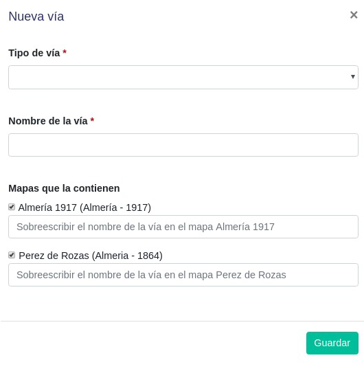

# Gestión de vías 

Para acceder a la gestión de vías en nuestra aplicación web lo haremos desde el segundo botón del menú lateral de navegación de la administración de nuestra aplicación web.

El icono del botón es el siguiente:

En esta sección podremos realizar las siguientes acciones:
- Añadir una vía nueva.
- Modificar una vía existente.
- Eliminar una vía existente.

## Nueva vía

El proceso para añadir una nueva vía consiste en hacer click sobre la ubicación deseada en el mapa para la nueva vía. A continuación se nos mostrará el siguiente formulario para rellenar con la información de la vía que queremos guardar.

Los campos de este formulario son los siguientes:

- Tipo de vía: Seleccionamos la categoría de la vía que queremos añadir.
- Nombre de la vía: Escribimos el nombre actual de la vía.
- Mapas que la contienen: Señalaremos de entre los mapas proporcionados por el usuario aquellos a los que pertenezca la vía que vamos a añadir. Si esta nueva vía dispone de un nombre distinto al actual en el mapa seleccionado podremos sobreescribir su nombre en dicho mapa mediante el campo de texto que se encuentra a continuación del mapa. En caso contrario, si la vía mantiene su nombre en dicho mapa dejaremos este campo vacío.

Una vez completado el formulario guardaremos la vía y nos aparecerá un nuevo marcador en la ubicación elegida para la vía. Para comprobar que se ha insertado correctamente podemos buscarla en el buscador.

## Vía existente

Como explicamos en el apartado anterior, al añadir una vía aparece un nuevo marcador azul para esta en el mapa. Para editar o eliminar una vía existente hacemos tenemos que hacer click sobre el marcador de la vía deseada y se nos desplegarán las siguientes tres opciones alrededor del marcador elegido.

###  Eliminar

El botón con icono de goma de borrar nos permite eliminar la vía seleccionada de la base de datos de forma definitiva después de una confirmación. 

###  Modificar vía

El botón con icono de lápiz nos permite modificar los datos de la vía seleccionada mediante el mismo formulario que usamos en el apartado anterior para añadir una vía nueva. En este caso el formulario tendrá todos los campos rellenos con los datos de la vía que vamos a modificar.

###  Reposicionar vía

El botón con icono de flechas nos permite cambiar la posición de una vía. Para ello, serán deshabilitados los demás marcadores dejando sólo disponible el marcador con el que estamos trabajando para que el usuario lo arrastre hasta la nueva posición. Una vez arrastrado a la nueva posición, los demás marcadores volverán a ser habilitados y automáticamente será guardado el cambio de posición.
