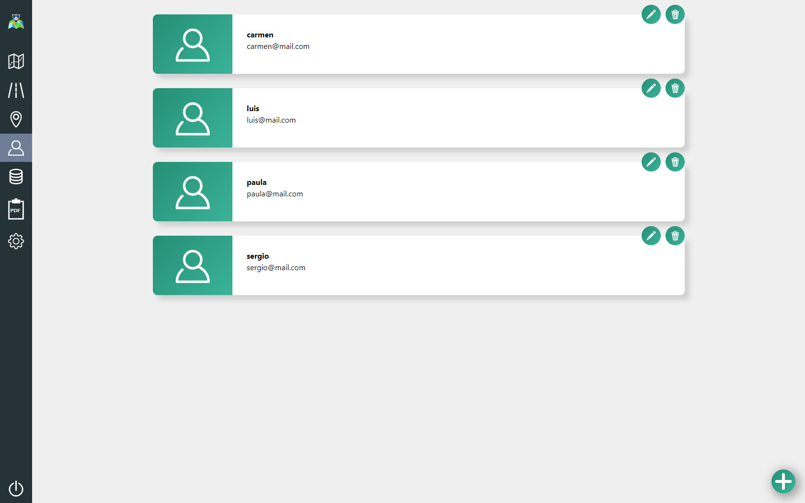
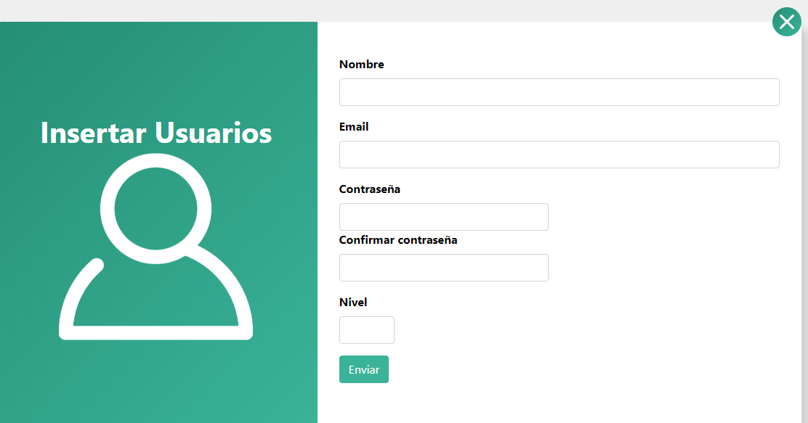
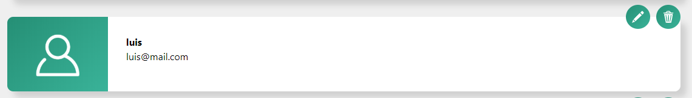
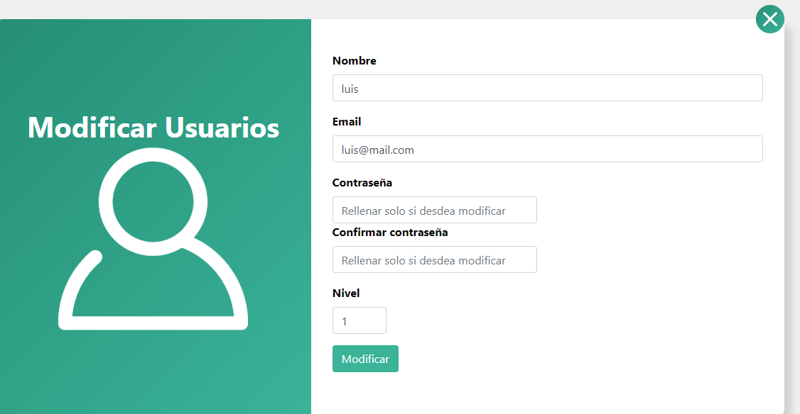
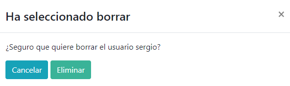

## USUARIOS

Cuando entramos en el panel de administración de usuarios, se nos muestra un listado de todos los usuarios registrados hasta el momento.

 

Las opciones aquí son:

1. **Añadir usuario.** 

    En la parte inferior derecha de la pantalla principal (donde vemos el listado de usuarios) se puede observar un botón con foma de cruz blanca sobre fondo verde, haga click en él para añadir un nuevo usuario. Se abrirá una pantalla con un formulario de registro en el que introducir los datos solicitados.

     

    

2. **Editar usuario**

    En cada uno de los usuarios encontraremos dos iconos arriba a la derecha, si hace click en el que representa un lápiz se abrirá la opción de editar usuario con un formulario en el que aparecen sus datos, tan solo tiene que sobreescribir aquellos que desea modificar.

    

    

3. **Borrar usuario**

    Al hacer click en el icono que representa una papelera aparecerá un mensaje de advertencia avisando de que está a punto de borrar un usuario y tendrá la posibilidad de eliminarlo o volver al menú anterior y cancelar el borrado.

    

 

   

